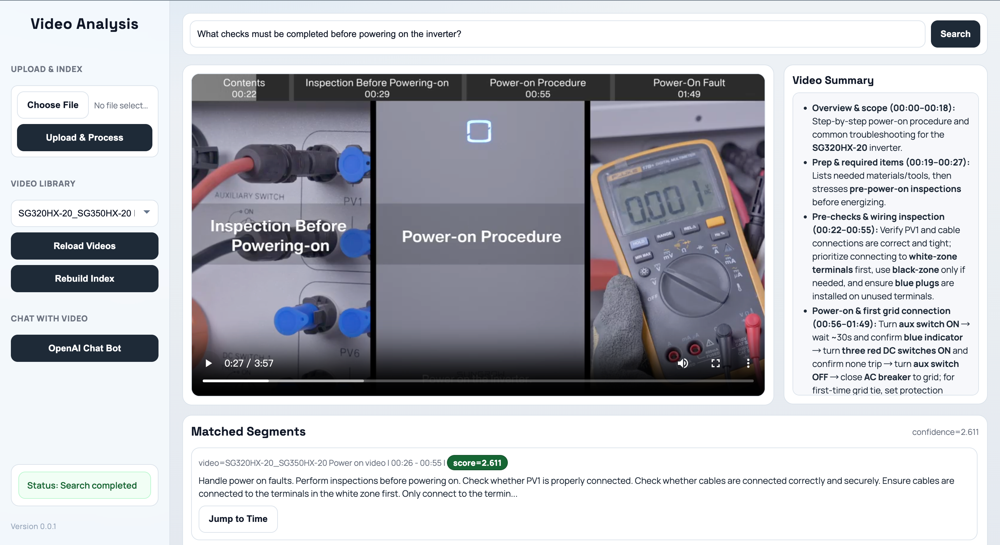
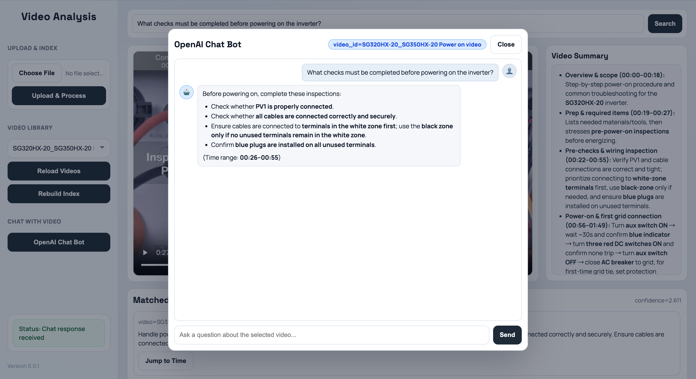

# Video Analysis

A video semantic search application built on Azure Content Understanding and Azure AI Search.  
The goal is to map natural-language questions directly to video timestamps and support one-click playback jump.




## 1. Overview

### 1.1 Pipeline

The current end-to-end processing flow is:

1. Upload a video from the frontend to `POST /pipeline/upload-and-process`.
2. Backend stores the file in Blob Storage (default container: `raw-videos`).
3. Backend generates a short-lived SAS URL and calls Content Understanding for analysis.
4. Parse CU output segments and text (prefer `transcriptPhrases`, fallback to `markdown`).
5. Build normalized chunk documents and write them to Blob (default path: `search-docs/<video_id>/latest.jsonl`).
6. Trigger Azure AI Search Indexer to ingest JSONL and generate vectors.
7. At query time, run Hybrid + Semantic retrieval and return `start_ms/end_ms/jump_start_ms/video_url` for direct player seek.

### 1.2 Features

- End-to-end upload, analysis, and indexing workflow.
- Indexed video listing and switching (`GET /videos`).
- Semantic retrieval (keyword + vector + semantic reranking).
- Intra-chunk jump refinement (`jump_start_ms`, configurable via ENV).
- Video summary (`GET /video-summary`, cache-enabled).
- Video chat (`POST /chat`) and streaming chat (`POST /chat/stream`).
- Startup auto-provisioning for required resources (Index/DataSource/Skillset/Indexer/Blob containers).

## 2. Quick Start

### 2.1 Prerequisites

- Python 3.11+
- Azure Storage Account (Blob)
- Azure Content Understanding resource (with available analyzer)
- Azure AI Search service
- Azure OpenAI (required for embeddings; optional for chat/summary)

### 2.2 Environment Variables

Copy and edit:

```bash
cp .env.example .env
```

All variables from `src/config.py` are listed below:

Storage (required)
- `STORAGE_CONNECTION_STRING`
- `RAW_VIDEO_CONTAINER` (default: `raw-videos`)
- `SEARCH_DOCS_CONTAINER` (default: `search-docs`)

Content Understanding (required)
- `CU_ENDPOINT`
- `CU_API_KEY`
- `CU_API_VERSION` (default: `2025-11-01`)
- `CU_ANALYZER_ID` (default: `prebuilt-videoSearch`)

Azure AI Search (required)
- `SEARCH_ENDPOINT`
- `SEARCH_ADMIN_KEY`
- `SEARCH_API_VERSION` (default: `2025-09-01`)
- `SEARCH_INDEX_NAME` (default: `video-chunks-index`)
- `SEARCH_DATASOURCE_NAME` (default: `video-chunks-ds`)
- `SEARCH_SKILLSET_NAME` (default: `video-chunks-skillset`)
- `SEARCH_INDEXER_NAME` (default: `video-chunks-indexer`)

Embedding (required, used by Search skillset)
- `AOAI_ENDPOINT`
- `AOAI_API_KEY`
- `AOAI_EMBEDDING_DEPLOYMENT`
- `AOAI_EMBEDDING_MODEL_NAME` (default: `text-embedding-3-small`)
- `AOAI_EMBEDDING_DIMENSIONS` (default: `1536`)

Chat/Summary (optional)
- `CHAT_MODEL_ENDPOINT`
- `CHAT_MODEL_DEPLOYMENT`
- `CHAT_MODEL_API_KEY` (falls back to `AOAI_API_KEY` if empty)

Query behavior (optional)
- `TOP_K` (default: `5`)
- `CANDIDATE_K` (default: `50`)
- `ENABLE_INTRA_CHUNK_JUMP` (default: `true`)
- `SEARCH_JUMP_PREROLL_SECONDS` (default: `0`, currently read by frontend)

Auto-provisioning (optional)
- `AUTO_PROVISION_ON_STARTUP` (default: `true`)
- `AUTO_PROVISION_FAIL_FAST` (default: `false`)

Soft delete (optional)
- `SOFT_DELETE_COLUMN_NAME`
- `SOFT_DELETE_MARKER_VALUE` (default: `true`)

### 2.3 Local Development

```bash
pip install -r requirements.txt
uvicorn app.main:app --reload --port 8000
```

Then open `http://localhost:8000`.

### 2.4 Docker

```bash
docker build -t video-analysis:latest .
docker run --rm -p 8000:8000 --env-file .env video-analysis:latest
```

Container startup command:

```bash
uvicorn app.main:app --host 0.0.0.0 --port ${PORT:-8000}
```

### 2.5 First Deployment and Resource Provisioning

By default, backend startup runs idempotent provisioning:

- Create/update Blob containers
- Create/update Search Index
- Create/update DataSource
- Create/update Skillset
- Create/update Indexer

Notes:
- Restarting the service runs create-or-update again; it does not delete existing resources.
- To fail service startup when provisioning fails, set `AUTO_PROVISION_FAIL_FAST=true`.

Manual admin endpoints:
- `POST /admin/provision`: run create-or-update manually
- `POST /admin/rebuild`: delete and recreate index-related resources (for structural changes or full rebuild)

## 3. Basic Usage

### 3.1 Web UI

1. In `Upload & Index`, select a video and click `Upload & Process`.
2. After processing, select a target video in `Video Library` (or keep `All videos`).
3. Enter a natural-language question in the top search box and click `Search`.
4. Click any item in `Matched Segments`; the player jumps to the returned timestamp.
5. View `Video Summary` on the right; open `OpenAI Chat Bot` on the left for grounded Q&A.

### 3.2 API Endpoints

- `GET /`: frontend page
- `GET /favicon.ico`: site icon
- `GET /health`: service status + startup provision snapshot
- `GET /ui-config`: UI runtime config
- `GET /videos`: indexed video list
- `POST /pipeline/upload-and-process`: upload and process video
- `POST /search`: semantic search
- `POST /admin/provision`: manual provision
- `POST /admin/rebuild`: rebuild search resources
- `GET /video-summary`: video summary
- `POST /chat`: non-streaming chat
- `POST /chat/stream`: streaming chat (NDJSON)

### 3.3 Common Operations

- Incremental ingestion for new videos: upload and process directly, no reset required.
- Refresh video list in UI: click `Reload Videos`.
- Recreate index structure: click `Rebuild Index` (or call `POST /admin/rebuild`).
